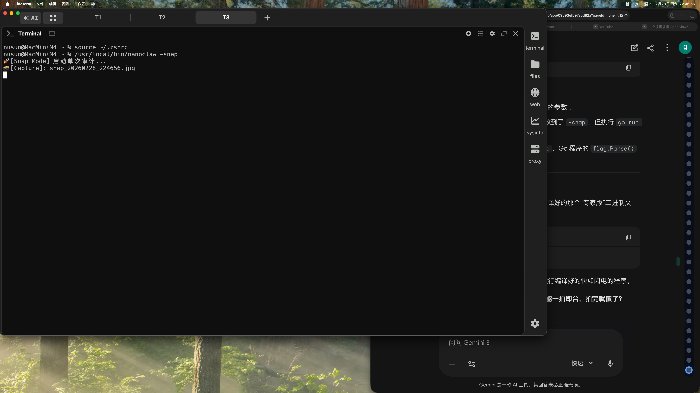

# 👁️ AR Audit

The image shows a computer screen with an open window displaying a webpage or application. The screen is black, indicating that it's turned off at the moment. There are several tabs visible in the window, including one labeled "focus" which could be used to direct attention towards a specific section of the page. Additionally, there are multiple words displayed on the screen, such as "bug," "focus," and "keywords." These words might suggest that the user is working on a task related to software development or troubleshooting an issue with their computer program.