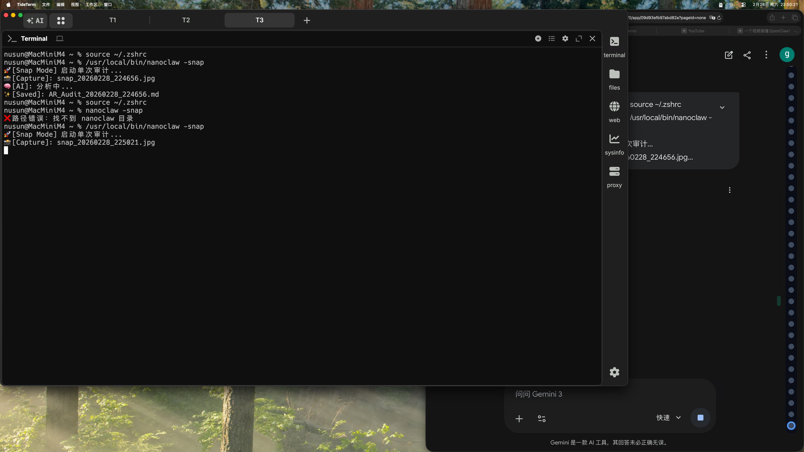

# 👁️ AR Audit

The image shows a computer screen with various windows open, including one that displays the error message "There is an error in your code." The error message indicates that there might be an issue with the code or the program itself. It's important to identify and fix such errors to ensure smooth operation of the software.