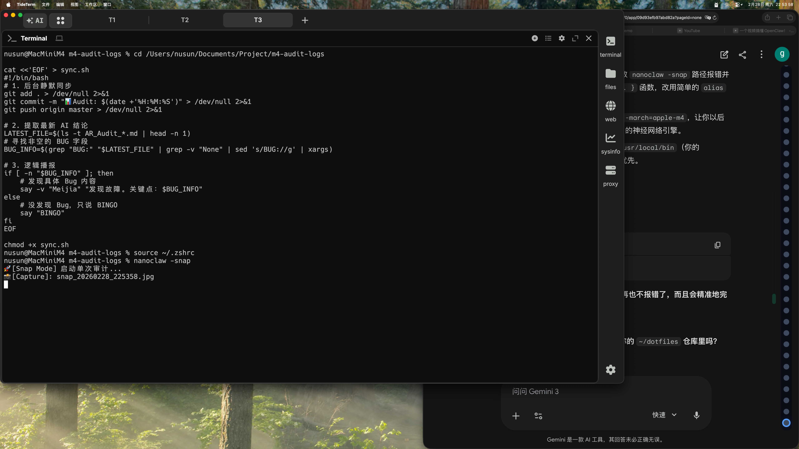

# 👁️ AR Audit

The image shows a computer screen with various elements displayed, including a window that appears to be an error message or a pop-up window. The screen is black in color, which makes it easy for the user to see any errors or messages displayed. There are also some words visible on the screen, such as "bug," "focus," and "keywords." These words could potentially indicate that there is an issue with the computer's functionality or a problem related to the software being used.