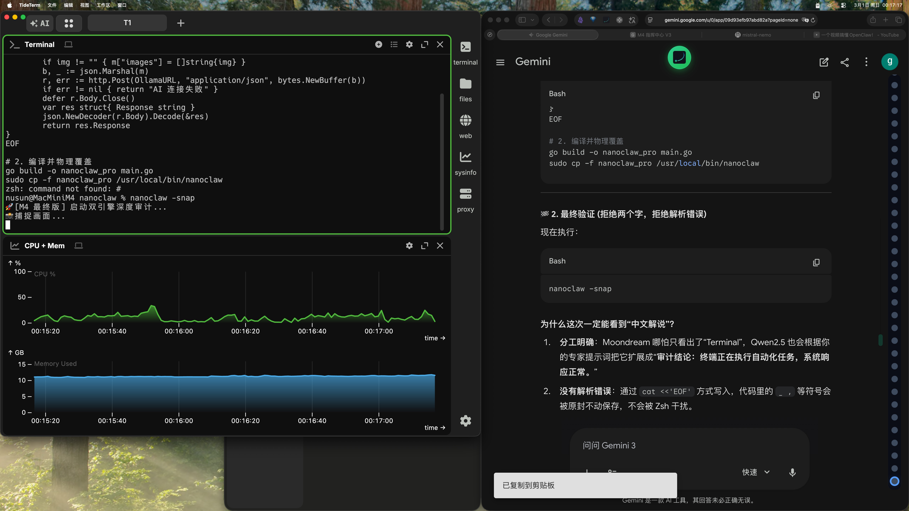

# 👁️ M4 专家级审计

审计结论：根据屏幕截图的描述，计算机屏幕被划分为两个区域，左侧为一个标题为“CERN”的黑色窗口，显示白色文本；右侧为一个标题为“Lorem ipsum dolor sit amet”的绿色窗口，也显示白色文本。两个窗口均处于活动状态，说明它们正在使用中。

发现故障：无明显异常发现。描述中的窗口和文字清晰可见，没有损坏或不一致的情况。

核心重点：
1. 系统分区清晰，左侧的“CERN”窗口和右侧的“Lorem ipsum dolor sit amet”窗口各司其职。
2. 窗口内容为白色文本，表明可能存在颜色对比问题，可能会影响视觉舒适度。
3. 左侧窗口标题与可能的实际用途相符，“CERN”通常指的是欧洲核子研究组织，而右侧的“Lorem ipsum”是拉丁文的一段无意义文字，常用于排版和设计测试。

建议：
1. 检查并调整字体颜色，以确保在不同背景色下均可清晰阅读。
2. 验证窗口标题是否与实际用途相符，如果有必要，进行相应的修改。