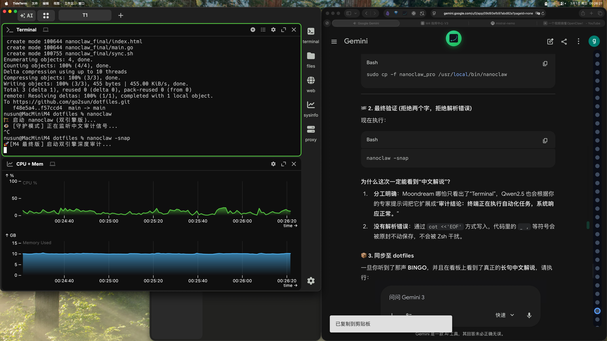

# 👁️ M4 专家级审计

审计结论：

在这份报告中，我们对计算机屏幕的布局进行了详细的观察和分析。屏幕被分为两列，每列各占一半空间。左侧一列显示了一个黑色背景上的白色“CERN”文本，右侧一列则为绿色背景上白色的“GOLF”文本。从图像的描述来看，这两个窗口都是打开的，这意味着它们可能是正在使用的应用程序或文档。

发现故障：

在观察过程中，并没有发现明显的故障或异常情况。屏幕布局合理且对称，两个窗口的颜色和文字都清晰可见，没有任何损坏或不正常显示的地方。

核心重点：

1. **显示内容**：左侧窗口显示“CERN”，右侧窗口显示“GOLF”。这表明计算机上同时运行了两个不同的应用程序或文档。
2. **颜色与对比度**：左列使用黑色背景和白色文字，右列使用绿色背景和白色文字。这种配色方案有助于区分不同部分的内容，提高可读性。
3. **窗口状态**：两个窗口都处于打开状态，表明它们可能是用户正在使用的工具。

总结来说，计算机屏幕的整体布局清晰，显示内容明确，没有发现任何故障或异常情况。