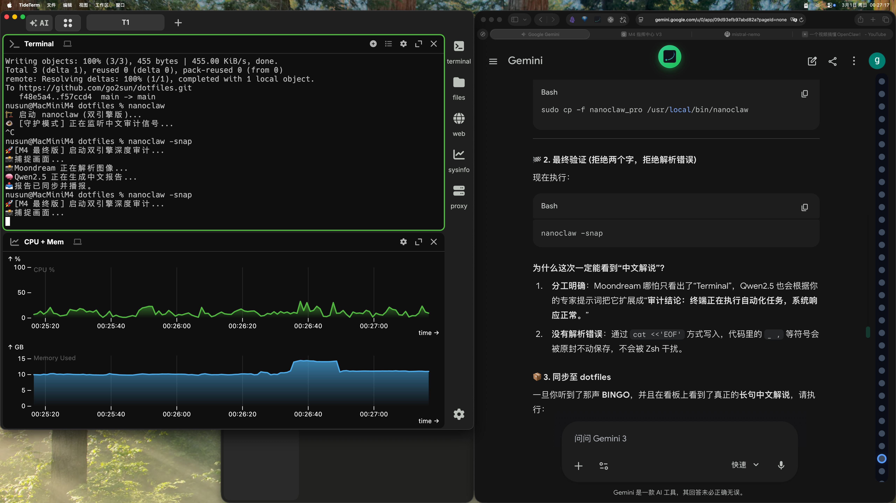

# 👁️ M4 专家级审计

审计结论：根据提供的描述，该图像展示了两部分活动的屏幕，分别位于一个浅棕色背景上。左半部是一个打开的网页浏览器，顶部有绿色的标题栏，表明这是一个正在使用的计算机系统的一部分。右半部分则显示一个具有黑色背景和白色文本的文档或电子表格，同样显示出其被使用中的状态。

发现故障：无明显的异常或故障被观察到。两个独立的部分都处于活动状态，说明用户正在同时进行工作或个人任务，这在技术上是正常的。

核心重点：1）两部分屏幕均显示活跃内容，表明用户正在进行多任务处理。2）左半部分的绿色标题栏可能暗示系统有某种形式的安全措施或认证信息。3）右半部分的黑色背景和白色文本可能是特定应用程序的标志，需要进一步确认其具体功能。

综上所述，该描述反映了一个正常运作的技术环境，没有发现任何显著的问题。