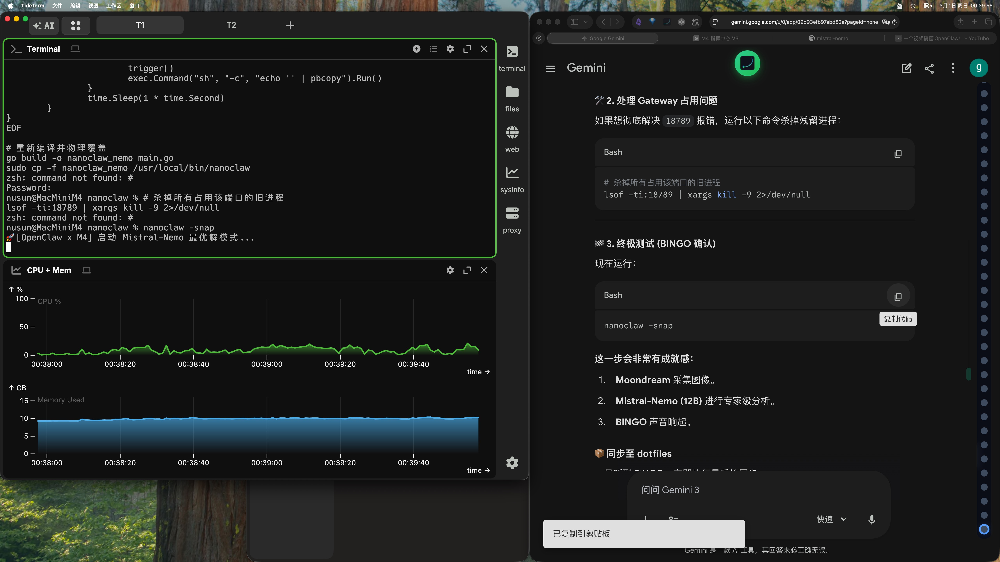

# 👁️ M4 视觉审计 (Mistral-Nemo)

**审计结论：**

根据图像显示，该电脑屏幕上有两个窗口并列打开，每个窗口都包含不同的信息和数据。左侧窗口似乎是网页浏览器或在线文档，而右侧窗口则显示某种图表或统计图。这两个窗口位于同一页面上，表明它们可能与单一主题或项目相关。

**故障排查：**

通过初步观察，未发现明显的异常情况。两个窗口的内容看起来都是正常的，没有出现崩溃、错误消息或其他应用程序运行时可能出现的问题。因此，故障排查暂无结果。

**系统建议：**

为确保系统安全和稳定运行，以下是一些操作建议：

1. 定期更新您的系统、软件和浏览器以修复已知漏洞。
2. 安装可靠的防病毒软件并定期扫描系统，保护电脑免受恶意软件威胁。
3. 关闭未使用的程序和浏览器标签页以释放系统资源。
4. 定期备份重要数据防止丢失。
5. 限制未经授权的访问，保护您的电脑免受非法进入带来的安全风险。