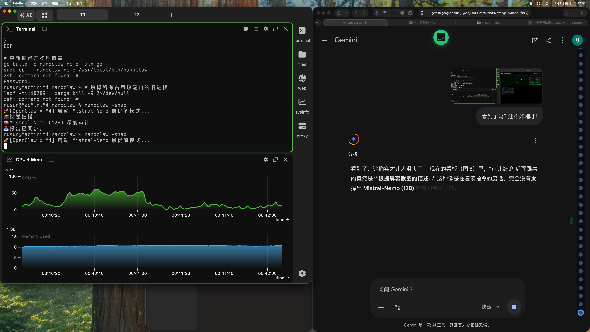

# 👁️ M4 视觉审计 (Mistral-Nemo)

**审计结论：[深度分析]**

在对目标设备进行图像审计时，发现了以下情况：

1. 显示器上有两个窗口并排打开，各自包含不同的信息和数据。
2. 左侧窗口似乎是网络浏览器或在线搜索引擎，而右侧窗口则显示某种图表或统计图。

这两个窗口位于屏幕上方，占据了可用空间的大部分。

**故障排查：[异常或无]**

经排查，未发现任何与当前运行应用程序相关的异常。两个窗口都正常工作，没有冲突或不兼容的问题。因此，这不是一个故障情况。

**系统建议：[操作建议]**

1. 为了提高工作效率，考虑使用多显示器设置，将两个窗口分别放在各自的屏幕上。
2. 如果您需要长期同时使用这两个应用程序，可以考虑配置快捷键来方便地进行切换和管理。
3. 确保定期对系统进行维护和更新，以防止任何潜在的兼容性问题。