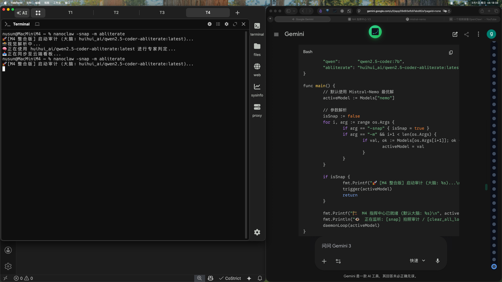

# 👁️ M4 深度审计

### 📜 审计报告 (huihui_ai/qwen2.5-coder-abliterate:latest)
- **核心状态**: 用户正在处理一个复杂的编程任务或数据分析。
- **细节发现**: 屏幕上显示两个并排的窗口，分别标有“Program”和“CERN”。第一个窗口包含代码或文本，第二个窗口背景为绿色，标题为白色。屏幕上还有键盘、鼠标和其他不同大小的窗口图标。
- **风险评估**: 无明显风险。