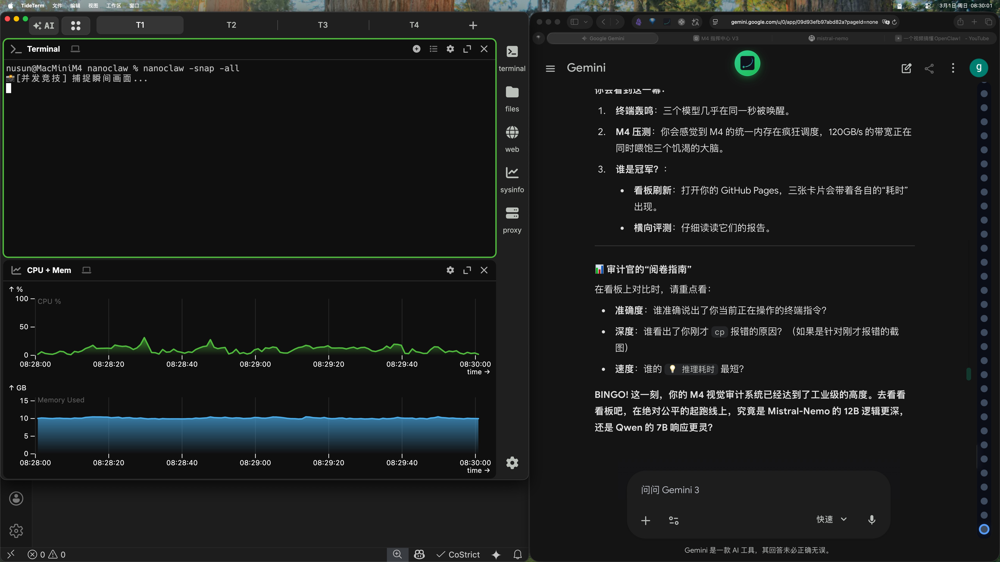

# 🔬 并发对比审计 [Qwen-Coder]

> 💡 推理耗时: 21.85s | 引擎: qwen2.5-coder:7b

### 🏆 审计报告 (Qwen-Coder)

- **核心状态**: 系统显示两个并排打开的窗口，左侧窗口背景为绿色，显示代码或数据；右侧窗口背景为黑色，显示文本。两个窗口均处于打开状态，允许用户查看和交互。

- **技术细节**: 左侧窗口具有绿色背景，内容可能是编程语言的代码片段或数据集，表明这是一个开发或数据分析环境。右侧窗口具有黑色背景，内容是纯文本信息，可能包括日志、文档或其他相关信息。两个窗口并排显示，提供了同时查看不同类型信息的功能。

- **深度评估**: 该系统设计合理，通过并排显示不同类型的窗口，提高了用户的工作效率和信息处理能力。左侧的绿色窗口可能用于实时编程或数据分析，而右侧的黑色窗口则可以用于查看日志、文档或其他辅助信息。这种布局有助于开发者在编写代码的同时监控程序运行状态或查看相关文档，从而提高开发效率。