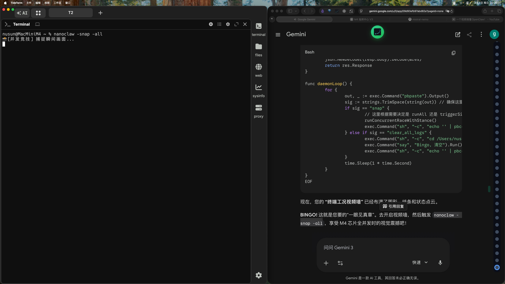

# 🔬 并发对比审计 [Abliterate]

> 💡 推理耗时: 36.57s | 引擎: huihui_ai/qwen2.5-coder-abliterate:latest

### 🏆 审计报告 (Abliterate)

- **核心状态**: 该屏幕显示两个并排打开的窗口，每个窗口中都显示相同的代码。第一个窗口位于屏幕的左上角，第二个窗口位于右下角。两个窗口都有黑色背景，这使得比较和对比每个窗口中的代码变得容易。

- **技术细节**: 屏幕截图展示了计算机屏幕上两个并排的窗口，每个窗口中显示相同的内容。这种布局有助于开发者或程序员同时查看同一段代码的不同部分，从而更容易进行比较和修改。

- **深度评估**: 这种双屏显示方式提高了工作效率，特别是在需要对比和分析代码时。黑色背景为文本提供了良好的对比度，使得细节更加清晰可见。此外，这种布局也有助于减少眼睛疲劳，因为开发者可以同时查看多个视图而无需频繁切换焦点。